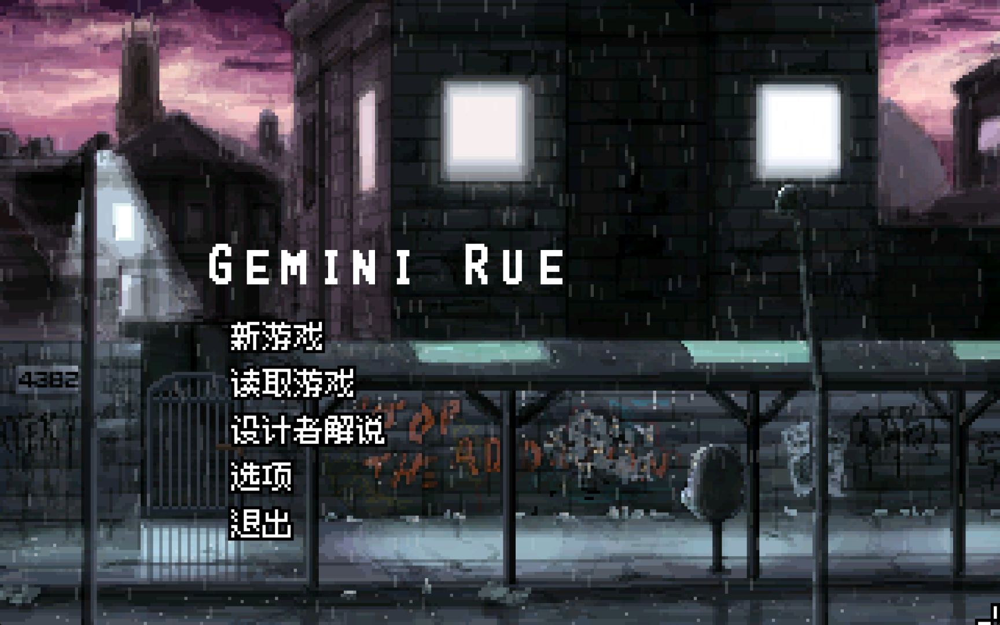
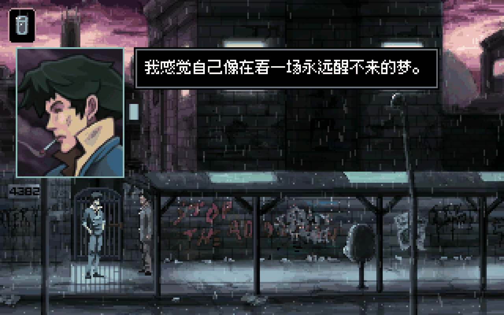
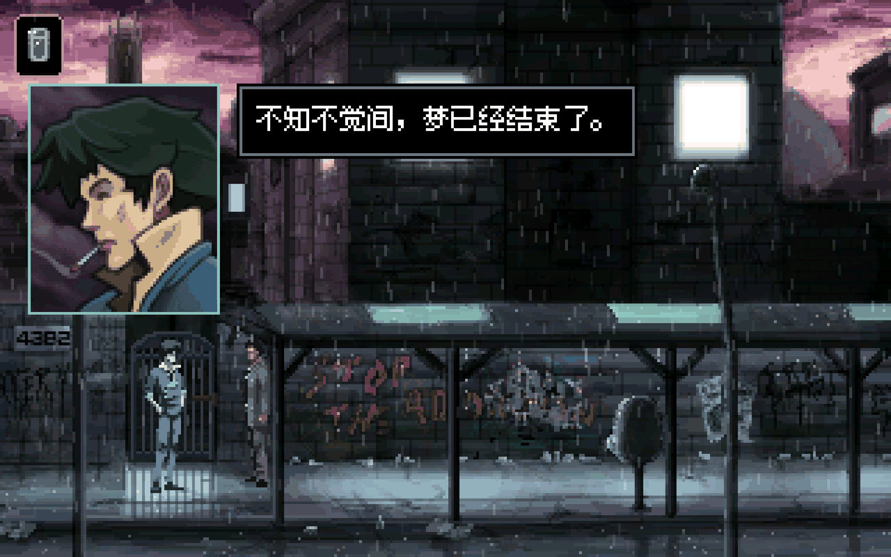

# Gemini Rue 简体中文汉化补丁

[English](README_en.md) | [](https://github.com/BebopSpikeSpiegel/gemini-rue-chinese-localization/releases)

《Gemini Rue》（通译《双子座行动》，又译《双子星之雨》；Wadjet Eye Games，2011）非官方简体中文汉化补丁。这是一部赛博朋克黑色侦探冒险游戏——雨水浸透的殖民星、记忆与身份的追问、深植 Cowboy Bebop 血脉的忧郁气质。一部值得中文玩家等十五年的作品，现在它有中文了。

📺 **[汉化发布 + 前10分钟实机演示（B 站视频）](https://www.bilibili.com/video/BV1KS3M6wE6x)** —— 游玩中遇到问题欢迎在视频评论区或 [Issues](https://github.com/BebopSpikeSpiegel/gemini-rue-chinese-localization/issues) 反馈



## 适用版本

- **Steam 版（2026 年 AGS 3.6.1 重制构建）**——补丁基于该版本制作，并已**全流程通关验证**（v1.0.0）
- 旧版 GOG / 实体版基于老引擎（不支持 UTF-8），**不保证兼容**

## 安装

1. 到 [Releases](https://github.com/BebopSpikeSpiegel/gemini-rue-chinese-localization/releases) 下载最新的 `GeminiRue-SChinese-*.zip`
2. 全部解压到游戏根目录（`Steam\steamapps\common\Gemini Rue\`，即 `Gemini Rue.exe` 所在目录），共 5 个游戏文件：`SChinese.tra` + `agsfnt3.ttf`～`agsfnt6.ttf`
3. 用记事本打开游戏目录下的 `.config` 文件，把 `translation=German,Polish` 改成 `translation=German,Polish,SChinese`，保存（这一步是让语言出现在设置菜单里）
4. 在 Steam 点"开始游戏"，启动弹窗里选 **Settings / 游戏设置**（也可以直接双击游戏目录里的 `winsetup.exe`），在语言下拉框选 **SChinese**，保存
5. 启动游戏

> 备选方案：跳过第 3、4 步，直接用记事本打开游戏目录下 `acsetup.cfg`，在 `[language]` 段写入 `translation=SChinese`，效果相同。

**卸载**：删除上述 5 个文件，并将 `acsetup.cfg` 的 `translation=` 改回空值。不影响存档。

## 覆盖范围

- 全部游戏文本 **5,973 行**：对话、旁白、终端数据库、报纸、日记、UI、按键提示、开发者解说与花絮模式
- **成就界面 32 条**（官方德语/波兰语翻译未覆盖的盲区，本补丁额外挖掘补全）
- 像素风 CJK 字体（Fusion Pixel Font，与原版像素美术同分辨率渲染）

## 已知限制

- 列表控件条目（终端搜索结果列表、成就列表、**通讯器的笔记/姓名/电话列表**）为 AGS 引擎级 ListBox，不经过翻译查找，保留英文（官方德/波翻译同样如此；这些条目的译文已备好在源文件中，若引擎未来支持即自动生效）
- 语音为英文原声（汉化仅覆盖文本）
- 终端检索：把通讯器里的中文笔记**拖入搜索框**即可正常检索（v0.9.1 起）；手动打字仍支持部分英文关键词（如 `Highrise`、`Howard`）作为后备

## 从源码构建

```
python tools/build_tra.py        # source/SChinese.trs -> dist/SChinese.tra
```

`source/SChinese.trs` 是唯一事实来源（英中逐行对照，UTF-8）。`tools/tra.py` 实现了 AGS 3.6.1 TRA 格式的编译与解析（对官方 .tra 做过逐字节往返验证）。字体不入库，Release 由 CI 自动从 [Fusion Pixel Font](https://github.com/TakWolf/fusion-pixel-font) 固定版本打包。

## AI 使用声明

本补丁采用 **AI 批量翻译 + 人工全程把关**的混合工作流，以下如实说明分工：

**工具与模型**：Anthropic Claude Code。逆向工程、工具链、流程编排与质检由 Claude Fable 5 完成；正文翻译与审校由 **144 个 Claude Opus 4.8 代理**执行——全文分为 72 块，每块经过"翻译 → 独立审校"双阶段流水线，全程受一份翻译圣经约束（完整剧情与结局反转的防剧透纪律、逐角色声线规范、锁定译名表、语音同步标记等机械性硬约束）。之后进行程序化校验（语音标记/换行符/格式符逐行核对）与全局一致性清查（术语漂移零检出、重复台词对齐）。

**我做了什么**：发起并统筹项目；两轮检查点中的全部译名与风格决策（人名音译方案、代号保留拉丁、"暴力团"、动词标签等均为人工拍板）；母语者逐行审读与反馈；实机游玩测试与问题回报；对最终文本负责。

**AI 做了什么**：TRA 二进制格式逆向与编译器实现；字体替换方案验证；故事圣经与词汇表起草；5,973 行初翻与互审；机械校验与一致性清查；成就字符串从游戏数据中的挖掘与补翻。

发现翻译问题请提 [Issue](https://github.com/BebopSpikeSpiegel/gemini-rue-chinese-localization/issues)，附截图与位置描述即可。

## 致谢

- **Joshua Nuernberger** 与 **Wadjet Eye Games** —— 创作了这部杰作，并在发售十五年后仍持续维护更新。若官方愿意收编本翻译为官方中文，许可证已为此敞开大门（见下）
- **TakWolf** 的 [Fusion Pixel Font](https://github.com/TakWolf/fusion-pixel-font)（SIL OFL-1.1）
- Adventure Game Studio 引擎与社区
- Anthropic Claude

## 许可

见 [LICENSE](LICENSE)。要点：

- 任何人可自由复制、分发、修改本补丁，**禁止商业用途**，需署名
- **原作者特许**：Wadjet Eye Games, LLC 与 Joshua Nuernberger 获永久、免版税、不可撤销的商用许可——包括将本翻译收编为官方中文本地化
- 游戏原文文本版权归原作者所有；补丁中包含英文原文系 .tra 键值机制的技术必需；原作者提出要求即配合下架
- 字体按 [SIL OFL-1.1](THIRD_PARTY/OFL.txt) 另行许可

### _**SEE YOU, SPACE COWBOY...**_



